# Gestión de Efectivo y Notificaciones WhatsApp

## Índice
1. [Recursos de Efectivo (Cash)](#recursos-de-efectivo-cash)
2. [Notificaciones WhatsApp](#notificaciones-whatsapp)
3. [Ejemplos de Uso](#ejemplos-de-uso)
4. [Ajustes Frontend Requeridos](#ajustes-frontend-requeridos)
5. [Componentes de UI Sugeridos](#componentes-de-ui-sugeridos)

---

## Recursos de Efectivo (Cash)

### Descripción General

El efectivo es un tipo especial de recurso que **NO controla inventario**. A diferencia de recursos físicos (sillas, equipos, vehículos), el efectivo se solicita como presupuesto para una reunión y se gasta, no se devuelve al inventario.

### Características del Efectivo

- **Categoría**: `cash`
- **No controla inventario**: El campo `is_inventory_tracked` está en `false`
- **Siempre disponible**: No hay validación de stock disponible
- **No se reserva**: No afecta el campo `reserved_quantity`
- **No se devuelve**: No hay proceso de retorno al inventario
- **Requiere propósito**: Debe registrarse el propósito del dinero solicitado

### Campo: `is_inventory_tracked`

Todos los recursos tienen este campo booleano que indica si controlan inventario:

```json
{
  "id": 123,
  "name": "Efectivo para gastos",
  "category": "cash",
  "is_inventory_tracked": false,  // ← No controla inventario
  "stock_quantity": null,
  "reserved_quantity": null,
  "available_quantity": 2147483647  // Siempre disponible (PHP_INT_MAX)
}
```

**Recursos con inventario** (is_inventory_tracked = true):
- Sillas, mesas, carpas
- Vehículos
- Equipos de sonido
- Materiales impresos
- Etc.

**Recursos sin inventario** (is_inventory_tracked = false):
- Efectivo (cash)
- Servicios externos
- Personal contratado por evento
- Etc.

### Campo: `cash_purpose`

Las asignaciones de recursos incluyen un nuevo campo `cash_purpose` para registrar el propósito del dinero:

```json
{
  "id": 456,
  "title": "Recursos para reunión comunitaria",
  "meeting_id": 789,
  "cash_purpose": "Refrigerios para 50 personas, transporte del equipo de apoyo y materiales impresos",
  "items": [
    {
      "resource_item_id": 123,
      "quantity": 500000,  // $500,000 COP
      "notes": "Efectivo para gastos operativos"
    }
  ]
}
```

---

## Notificaciones WhatsApp

### Descripción General

El sistema envía notificaciones automáticas de WhatsApp al **planificador de la reunión** en dos momentos:

1. **Cuando se asigna una reunión** (el usuario es designado como planificador)
2. **Cuando se asignan recursos** a una reunión que tiene planificador

### 1. Notificación: Reunión Asignada

**Cuándo se envía**: Al crear una reunión con `planner_user_id`

**Requisitos**:
- La reunión debe tener un planificador (`planner_user_id`)
- El planificador debe tener teléfono registrado
- El teléfono debe estar en formato válido

**Formato del mensaje**:
```
🗓️ Nueva Reunión Asignada

Título: Reunión con líderes comunitarios
Fecha: 16/11/2025 14:30
Lugar: Salón comunal Barrio Centro

Has sido asignado como planificador de esta reunión.
```

**Implementación Backend**:
```php
// En MeetingController::store()
$meeting->load('planner');
if ($meeting->planner && $meeting->planner->phone) {
    $this->sendMeetingAssignmentNotification($meeting, $whatsappService, $user);
}
```

### 2. Notificación: Recursos Asignados

**Cuándo se envía**: Al crear una asignación de recursos vinculada a una reunión

**Requisitos**:
- La asignación debe estar vinculada a una reunión (`meeting_id`)
- La reunión debe tener un planificador
- El planificador debe tener teléfono registrado

**Formato del mensaje**:
```
📦 Recursos Asignados

Reunión: Reunión con líderes comunitarios
Fecha: 16/11/2025 14:30
Asignación: Material logístico

Recursos:
• Sillas plásticas (x50)
• Mesas plegables (x5)
• Equipo de sonido (x1)
• Efectivo para gastos (x500000)

Costo Total: $850.000
Fecha de entrega: 15/11/2025
```

**Implementación Backend**:
```php
// En ResourceAllocationController::store()
if ($resource->meeting_id) {
    $resource->load(['meeting.planner', 'items.resourceItem']);
    $meeting = $resource->meeting;
    
    if ($meeting && $meeting->planner && $meeting->planner->phone) {
        $this->sendResourceAssignmentNotification($resource, $meeting, $whatsappService, auth('api')->user());
    }
}
```

### Proceso de Envío

1. **Normalización de teléfono**: Se agrega prefijo `57` si no existe (Colombia)
2. **Formato del mensaje**: Markdown de WhatsApp (negrita con asteriscos, emojis)
3. **Webhook de N8N**: El mensaje se envía al webhook configurado
4. **Token de autenticación**: Se usa el token del tenant (superadmin)
5. **Logs**: Se registran éxitos y errores en logs de Laravel

**Configuración del webhook** (en `.env`):
```env
N8N_WHATSAPP_WEBHOOK_URL=https://n8n.tu-dominio.com/webhook/whatsapp
```

---

## Ejemplos de Uso

### Ejemplo 1: Crear Reunión con Planificador

**Request**:
```http
POST /api/v1/meetings
Authorization: Bearer {token}
Content-Type: application/json

{
  "title": "Reunión con líderes comunitarios",
  "datetime": "2025-11-16T14:30:00",
  "location": "Salón comunal Barrio Centro",
  "planner_user_id": 789,  // ← Se envía notificación WhatsApp
  "type": "community",
  "notes": "Discusión sobre proyectos 2026"
}
```

**Response**:
```json
{
  "data": {
    "id": 456,
    "title": "Reunión con líderes comunitarios",
    "datetime": "2025-11-16T14:30:00",
    "planner_user_id": 789,
    "planner": {
      "id": 789,
      "full_name": "Juan Pérez",
      "phone": "573001234567"
    }
  },
  "message": "Reunión creada exitosamente"
}
```

**Notificación enviada a**: `573001234567`

### Ejemplo 2: Asignar Recursos con Efectivo

**Request**:
```http
POST /api/v1/resource-allocations
Authorization: Bearer {token}
Content-Type: application/json

{
  "meeting_id": 456,
  "leader_user_id": 111,
  "title": "Material logístico y presupuesto",
  "allocation_date": "2025-11-15",
  "cash_purpose": "Refrigerios para 50 personas ($300,000), transporte del equipo ($150,000), materiales impresos ($50,000)",
  "items": [
    {
      "resource_item_id": 10,  // Sillas plásticas
      "quantity": 50,
      "notes": "Para asistentes"
    },
    {
      "resource_item_id": 11,  // Mesas plegables
      "quantity": 5
    },
    {
      "resource_item_id": 12,  // Equipo de sonido
      "quantity": 1
    },
    {
      "resource_item_id": 99,  // Efectivo (category: cash, is_inventory_tracked: false)
      "quantity": 500000,
      "notes": "Ver campo cash_purpose para detalle"
    }
  ]
}
```

**Response**:
```json
{
  "data": {
    "id": 789,
    "meeting_id": 456,
    "title": "Material logístico y presupuesto",
    "cash_purpose": "Refrigerios para 50 personas ($300,000), transporte del equipo ($150,000), materiales impresos ($50,000)",
    "allocation_date": "2025-11-15",
    "status": "pending",
    "total_cost": 850000,
    "items": [
      {
        "resource_item": {
          "id": 10,
          "name": "Sillas plásticas",
          "category": "furniture",
          "is_inventory_tracked": true,  // ← Controla inventario
          "stock_quantity": 150,
          "reserved_quantity": 50,  // ← Se reservó para esta asignación
          "available_quantity": 100
        },
        "quantity": 50,
        "status": "pending"
      },
      {
        "resource_item": {
          "id": 99,
          "name": "Efectivo para gastos",
          "category": "cash",
          "is_inventory_tracked": false,  // ← NO controla inventario
          "stock_quantity": null,
          "reserved_quantity": null,
          "available_quantity": 2147483647  // Siempre disponible
        },
        "quantity": 500000,
        "notes": "Ver campo cash_purpose para detalle"
      }
    ]
  },
  "message": "Asignación de recursos creada exitosamente"
}
```

**Notificación enviada a**: Planificador de la reunión 456

### Ejemplo 3: Verificar si un Recurso Controla Inventario

**Consultar recurso**:
```http
GET /api/v1/resource-items/99
Authorization: Bearer {token}
```

**Response**:
```json
{
  "data": {
    "id": 99,
    "name": "Efectivo para gastos",
    "category": "cash",
    "is_inventory_tracked": false,  // ← FALSE = No controla inventario
    "stock_quantity": null,
    "reserved_quantity": null,
    "available_quantity": 2147483647,
    "is_active": true
  }
}
```

**En el Frontend**:
```javascript
// Verificar si el recurso controla inventario
if (!resourceItem.is_inventory_tracked) {
  // Es efectivo o servicio sin inventario
  // NO mostrar validaciones de stock
  // NO mostrar "stock disponible"
  // SÍ mostrar campo para "propósito del dinero" (cash_purpose)
} else {
  // Es recurso físico con inventario
  // Mostrar stock disponible
  // Validar cantidad solicitada vs disponible
  // Mostrar alertas de stock bajo
}
```

### Ejemplo 4: Estados de Asignación y Notificaciones

**Estado: pending** → Se reserva inventario (si aplica)
```json
{
  "status": "pending",
  "items": [
    {
      "resource_item": {
        "stock_quantity": 100,
        "reserved_quantity": 20,  // ← Reservado para esta asignación
        "available_quantity": 80
      },
      "quantity": 20
    }
  ]
}
```

**Estado: delivered** → Se descuenta inventario (si aplica)
```json
{
  "status": "delivered",
  "items": [
    {
      "resource_item": {
        "stock_quantity": 80,  // ← Se descontó del stock
        "reserved_quantity": 0,  // ← Se liberó la reserva
        "available_quantity": 80
      },
      "quantity": 20
    }
  ]
}
```

**Estado: returned** → Se retorna inventario (si aplica, NO para efectivo)
```json
{
  "status": "returned",
  "items": [
    {
      "resource_item": {
        "stock_quantity": 100,  // ← Se retornó al stock
        "reserved_quantity": 0,
        "available_quantity": 100
      },
      "quantity": 20
    }
  ]
}
```

---

## Resumen de Campos Nuevos

| Campo | Tabla | Tipo | Descripción |
|-------|-------|------|-------------|
| `is_inventory_tracked` | resource_items | boolean | Indica si el recurso controla inventario |
| `cash_purpose` | resource_allocations | text | Propósito del dinero solicitado |

**Comportamiento**:
- `is_inventory_tracked = false`: NO se valida stock, NO se reserva, NO se descuenta, NO se retorna
- `is_inventory_tracked = true`: Se valida stock, se reserva (pending), se descuenta (delivered), se retorna (returned)

**Validación Frontend**:
- Si `is_inventory_tracked = false` y `category = 'cash'`: Mostrar campo obligatorio `cash_purpose`
- Si `is_inventory_tracked = true`: Validar que `quantity <= available_quantity`

**Notificaciones automáticas**:
- Al crear reunión con planificador: WhatsApp al planificador
- Al asignar recursos a reunión: WhatsApp al planificador de la reunión

---

## Notas Técnicas

### Webhook de N8N

El servicio `WhatsAppNotificationService` envía mensajes a través de un webhook de N8N:

**Payload enviado**:
```json
{
  "phone": "573001234567",
  "message": "🗓️ Nueva Reunión Asignada\n\nTítulo: ...",
  "token": "Bearer eyJ0eXAiOiJKV1QiLCJhbGc..."
}
```

**Headers**:
```
Content-Type: application/json
Authorization: Bearer {tenant_authentication_token}
```

### Logs

Todos los envíos de WhatsApp se registran en logs:

**Éxito**:
```
[INFO] Meeting assignment notification sent
- meeting_id: 456
- planner_id: 789
```

**Error**:
```
[ERROR] Failed to send meeting assignment notification
- meeting_id: 456
- planner_id: 789
- error: Connection timeout
```

### Seguridad

- Las notificaciones NO bloquean el flujo principal (try-catch)
- Si falla el envío de WhatsApp, la reunión/asignación se crea igual
- Los errores se registran pero no se retornan al usuario
- El token de autenticación es del tenant (superadmin)

---

## Flujo Completo

```mermaid
graph TD
    A[Usuario crea reunión] --> B{Tiene planificador?}
    B -->|Sí| C[Enviar WhatsApp: Reunión Asignada]
    B -->|No| D[No enviar notificación]
    C --> E[Usuario asigna recursos]
    D --> E
    E --> F{Reunión tiene planificador?}
    F -->|Sí| G[Enviar WhatsApp: Recursos Asignados]
    F -->|No| H[No enviar notificación]
    G --> I{Recurso es efectivo?}
    H --> I
    I -->|Sí| J[NO controlar inventario]
    I -->|No| K[Reservar inventario]
    J --> L[Fin]
    K --> L
```



---

## Ajustes Frontend Requeridos

### 1. Actualizar Interfaces TypeScript

#### Interface: ResourceItem

Agregar el campo `is_inventory_tracked`:

```typescript
export interface ResourceItem {
  id: number;
  name: string;
  description?: string;
  category: 'cash' | 'furniture' | 'vehicle' | 'equipment' | 'personnel' | 'material' | 'service' | 'other';
  unit: string;
  unit_cost: number;
  currency: string;
  stock_quantity?: number | null;
  reserved_quantity?: number | null;
  available_quantity?: number;
  min_stock?: number | null;
  supplier?: string;
  supplier_contact?: string;
  metadata?: Record<string, any>;
  is_active: boolean;
  is_inventory_tracked: boolean;  // ← NUEVO CAMPO
  is_low_stock: boolean;
  formatted_cost: string;
  created_at: string;
  updated_at: string;
}
```

#### Interface: ResourceAllocation

Agregar el campo `cash_purpose`:

```typescript
export interface ResourceAllocation {
  id: number;
  tenant_id: number;
  meeting_id?: number;
  meeting?: {
    id: number;
    title: string;
  };
  title: string;
  allocation_date?: string;
  notes?: string;
  cash_purpose?: string;  // ← NUEVO CAMPO
  status: 'pending' | 'delivered' | 'returned' | 'cancelled';
  total_cost: number;
  items: ResourceAllocationItem[];
  items_count: number;
  assigned_to_user_id: number;
  assigned_by_user_id: number;
  leader_user_id: number;
  created_at: string;
  updated_at: string;
}
```

### 2. Formulario de Asignación de Recursos

#### Detectar Recursos de Efectivo

Al seleccionar un recurso, verificar si es efectivo:

```typescript
// utils/resourceHelpers.ts
export const isCashResource = (resource: ResourceItem): boolean => {
  return resource.category === 'cash' && !resource.is_inventory_tracked;
};

export const requiresInventoryValidation = (resource: ResourceItem): boolean => {
  return resource.is_inventory_tracked;
};

export const hasAvailableStock = (resource: ResourceItem, requestedQty: number): boolean => {
  if (!resource.is_inventory_tracked) {
    return true; // Siempre disponible
  }
  return (resource.available_quantity ?? 0) >= requestedQty;
};
```

#### Componente: ResourceAllocationForm.tsx

```typescript
import { useState, useEffect } from 'react';
import { isCashResource, requiresInventoryValidation, hasAvailableStock } from '@/utils/resourceHelpers';

export default function ResourceAllocationForm() {
  const [selectedItems, setSelectedItems] = useState<Array<{
    resource_item_id: number;
    quantity: number;
    notes?: string;
  }>>([]);
  const [cashPurpose, setCashPurpose] = useState('');
  const [hasCashItem, setHasCashItem] = useState(false);

  // Detectar si hay items de efectivo
  useEffect(() => {
    const hasCash = selectedItems.some(item => {
      const resource = resources.find(r => r.id === item.resource_item_id);
      return resource && isCashResource(resource);
    });
    setHasCashItem(hasCash);
  }, [selectedItems, resources]);

  const handleAddItem = (resourceId: number, quantity: number) => {
    const resource = resources.find(r => r.id === resourceId);
    
    if (!resource) {
      alert('Recurso no encontrado');
      return;
    }

    // Validar stock solo si el recurso controla inventario
    if (requiresInventoryValidation(resource) && !hasAvailableStock(resource, quantity)) {
      alert(`Stock insuficiente. Disponible: ${resource.available_quantity}, Solicitado: ${quantity}`);
      return;
    }

    setSelectedItems([...selectedItems, {
      resource_item_id: resourceId,
      quantity,
      notes: ''
    }]);
  };

  const handleSubmit = async () => {
    // Validar que si hay efectivo, se ingresó el propósito
    if (hasCashItem && !cashPurpose.trim()) {
      alert('Debes especificar el propósito del dinero solicitado');
      return;
    }

    const payload = {
      meeting_id: meetingId,
      leader_user_id: leaderId,
      title: allocationTitle,
      allocation_date: deliveryDate,
      items: selectedItems,
      ...(hasCashItem && { cash_purpose: cashPurpose })  // Solo si hay efectivo
    };

    await createResourceAllocation(payload);
  };

  return (
    <form onSubmit={handleSubmit}>
      {/* Selector de recursos */}
      <ResourceSelector 
        onSelect={handleAddItem}
        resources={resources}
      />

      {/* Lista de items seleccionados */}
      <SelectedItemsList items={selectedItems} />

      {/* Campo condicional: Propósito del efectivo */}
      {hasCashItem && (
        <div className="mt-4 p-4 bg-yellow-50 border border-yellow-200 rounded-lg">
          <label className="block text-sm font-medium text-gray-700 mb-2">
            💰 Propósito del Efectivo Solicitado *
          </label>
          <textarea
            value={cashPurpose}
            onChange={(e) => setCashPurpose(e.target.value)}
            placeholder="Ejemplo: Refrigerios para 50 personas ($300,000), transporte del equipo ($150,000), materiales impresos ($50,000)"
            className="w-full px-3 py-2 border border-gray-300 rounded-md"
            rows={3}
            required
          />
          <p className="mt-1 text-xs text-gray-500">
            Describe detalladamente en qué se utilizará el dinero
          </p>
        </div>
      )}

      <button type="submit">Crear Asignación</button>
    </form>
  );
}
```

### 3. Selector de Recursos

#### Componente: ResourceSelector.tsx

Mostrar información diferente según el tipo de recurso:

```typescript
import { isCashResource, requiresInventoryValidation } from '@/utils/resourceHelpers';

interface ResourceSelectorProps {
  resources: ResourceItem[];
  onSelect: (resourceId: number, quantity: number) => void;
}

export default function ResourceSelector({ resources, onSelect }: ResourceSelectorProps) {
  const [selectedResource, setSelectedResource] = useState<ResourceItem | null>(null);
  const [quantity, setQuantity] = useState(1);

  const handleResourceChange = (resourceId: number) => {
    const resource = resources.find(r => r.id === resourceId);
    setSelectedResource(resource || null);
    
    // Si es efectivo, resetear cantidad a 0 para que el usuario ingrese el monto
    if (resource && isCashResource(resource)) {
      setQuantity(0);
    }
  };

  return (
    <div className="space-y-4">
      {/* Select de recursos */}
      <select onChange={(e) => handleResourceChange(Number(e.target.value))}>
        <option value="">Seleccionar recurso...</option>
        {resources.map(resource => (
          <option key={resource.id} value={resource.id}>
            {resource.name} - {resource.category}
          </option>
        ))}
      </select>

      {/* Información del recurso seleccionado */}
      {selectedResource && (
        <div className="p-4 bg-gray-50 rounded-lg">
          <h4 className="font-medium text-gray-900">{selectedResource.name}</h4>
          <p className="text-sm text-gray-600">{selectedResource.description}</p>
          
          {/* Mostrar stock SOLO si controla inventario */}
          {requiresInventoryValidation(selectedResource) ? (
            <div className="mt-2 space-y-1 text-sm">
              <p>
                <span className="font-medium">Stock Total:</span> {selectedResource.stock_quantity}
              </p>
              <p>
                <span className="font-medium">Reservado:</span> {selectedResource.reserved_quantity}
              </p>
              <p className="text-green-600 font-medium">
                <span>Disponible:</span> {selectedResource.available_quantity}
              </p>
              
              {selectedResource.is_low_stock && (
                <div className="mt-2 p-2 bg-orange-100 text-orange-800 rounded text-xs">
                  ⚠️ Stock bajo (mínimo: {selectedResource.min_stock})
                </div>
              )}
            </div>
          ) : (
            // Si NO controla inventario (efectivo)
            <div className="mt-2 p-2 bg-blue-50 text-blue-700 rounded text-sm">
              💰 Este recurso no controla inventario (siempre disponible)
            </div>
          )}

          {/* Input de cantidad */}
          <div className="mt-3">
            <label className="block text-sm font-medium text-gray-700 mb-1">
              {isCashResource(selectedResource) ? 'Monto ($COP)' : 'Cantidad'}
            </label>
            <input
              type="number"
              value={quantity}
              onChange={(e) => setQuantity(Number(e.target.value))}
              min={isCashResource(selectedResource) ? 0 : 1}
              max={requiresInventoryValidation(selectedResource) ? selectedResource.available_quantity : undefined}
              className="w-full px-3 py-2 border border-gray-300 rounded-md"
              placeholder={isCashResource(selectedResource) ? 'Ej: 500000' : '1'}
            />
            
            {/* Validación visual de stock */}
            {requiresInventoryValidation(selectedResource) && quantity > (selectedResource.available_quantity ?? 0) && (
              <p className="mt-1 text-sm text-red-600">
                ❌ Cantidad solicitada supera el stock disponible
              </p>
            )}
          </div>

          <button
            type="button"
            onClick={() => onSelect(selectedResource.id, quantity)}
            disabled={
              quantity <= 0 || 
              (requiresInventoryValidation(selectedResource) && quantity > (selectedResource.available_quantity ?? 0))
            }
            className="mt-3 px-4 py-2 bg-blue-600 text-white rounded-md disabled:bg-gray-300"
          >
            Agregar
          </button>
        </div>
      )}
    </div>
  );
}
```

### 4. Lista de Items Seleccionados

#### Componente: SelectedItemsList.tsx

Mostrar información diferente para efectivo vs. recursos con inventario:

```typescript
import { isCashResource } from '@/utils/resourceHelpers';

interface SelectedItemsListProps {
  items: Array<{
    resource_item_id: number;
    quantity: number;
    notes?: string;
  }>;
  resources: ResourceItem[];
  onRemove: (index: number) => void;
}

export default function SelectedItemsList({ items, resources, onRemove }: SelectedItemsListProps) {
  return (
    <div className="space-y-2">
      <h3 className="font-medium text-gray-900">Recursos Seleccionados</h3>
      
      {items.map((item, index) => {
        const resource = resources.find(r => r.id === item.resource_item_id);
        if (!resource) return null;

        const isCash = isCashResource(resource);

        return (
          <div key={index} className="flex items-center justify-between p-3 bg-white border rounded-lg">
            <div className="flex-1">
              <div className="flex items-center gap-2">
                <span className="font-medium">{resource.name}</span>
                {isCash && <span className="text-xs bg-yellow-100 text-yellow-800 px-2 py-0.5 rounded">Efectivo</span>}
              </div>
              
              <div className="mt-1 text-sm text-gray-600">
                {isCash ? (
                  // Formato para efectivo
                  <span className="font-medium text-green-600">
                    ${item.quantity.toLocaleString('es-CO')} COP
                  </span>
                ) : (
                  // Formato para recursos con inventario
                  <>
                    Cantidad: <span className="font-medium">{item.quantity}</span> {resource.unit}
                    {' • '}
                    Costo: ${(item.quantity * resource.unit_cost).toLocaleString('es-CO')}
                  </>
                )}
              </div>
            </div>

            <button
              type="button"
              onClick={() => onRemove(index)}
              className="text-red-600 hover:text-red-800"
            >
              🗑️
            </button>
          </div>
        );
      })}

      {items.length === 0 && (
        <p className="text-sm text-gray-500 text-center py-4">
          No hay recursos seleccionados
        </p>
      )}
    </div>
  );
}
```

### 5. Vista de Detalle de Asignación

#### Componente: ResourceAllocationDetail.tsx

Mostrar el campo `cash_purpose` cuando existe:

```typescript
import { isCashResource } from '@/utils/resourceHelpers';

interface ResourceAllocationDetailProps {
  allocation: ResourceAllocation;
}

export default function ResourceAllocationDetail({ allocation }: ResourceAllocationDetailProps) {
  const hasCashItem = allocation.items.some(item => 
    isCashResource(item.resource_item)
  );

  return (
    <div className="space-y-6">
      {/* Información básica */}
      <div>
        <h2 className="text-2xl font-bold">{allocation.title}</h2>
        <p className="text-gray-600">Estado: {allocation.status}</p>
      </div>

      {/* Propósito del efectivo (si aplica) */}
      {hasCashItem && allocation.cash_purpose && (
        <div className="p-4 bg-yellow-50 border border-yellow-200 rounded-lg">
          <h3 className="font-medium text-gray-900 mb-2 flex items-center gap-2">
            💰 Propósito del Efectivo
          </h3>
          <p className="text-gray-700 whitespace-pre-line">
            {allocation.cash_purpose}
          </p>
        </div>
      )}

      {/* Lista de recursos asignados */}
      <div>
        <h3 className="font-medium text-gray-900 mb-3">Recursos Asignados</h3>
        <div className="space-y-2">
          {allocation.items.map(item => {
            const isCash = isCashResource(item.resource_item);
            
            return (
              <div key={item.id} className="p-4 bg-white border rounded-lg">
                <div className="flex items-start justify-between">
                  <div className="flex-1">
                    <div className="flex items-center gap-2">
                      <h4 className="font-medium">{item.resource_item.name}</h4>
                      {isCash && (
                        <span className="text-xs bg-yellow-100 text-yellow-800 px-2 py-0.5 rounded">
                          Efectivo
                        </span>
                      )}
                      {!isCash && (
                        <span className="text-xs bg-gray-100 text-gray-600 px-2 py-0.5 rounded">
                          {item.resource_item.category}
                        </span>
                      )}
                    </div>

                    {/* Información específica del tipo de recurso */}
                    {isCash ? (
                      <div className="mt-2 text-sm">
                        <p className="text-green-600 font-semibold text-lg">
                          ${item.quantity.toLocaleString('es-CO')} COP
                        </p>
                        {item.notes && (
                          <p className="mt-1 text-gray-600">{item.notes}</p>
                        )}
                      </div>
                    ) : (
                      <div className="mt-2 text-sm space-y-1">
                        <p>
                          <span className="text-gray-600">Cantidad:</span>{' '}
                          <span className="font-medium">{item.quantity} {item.resource_item.unit}</span>
                        </p>
                        <p>
                          <span className="text-gray-600">Costo unitario:</span>{' '}
                          <span className="font-medium">${item.unit_cost.toLocaleString('es-CO')}</span>
                        </p>
                        <p>
                          <span className="text-gray-600">Subtotal:</span>{' '}
                          <span className="font-medium text-green-600">
                            ${item.subtotal.toLocaleString('es-CO')}
                          </span>
                        </p>
                      </div>
                    )}

                    {/* Estado del item */}
                    <div className="mt-2">
                      <span className={`text-xs px-2 py-1 rounded ${
                        item.status === 'pending' ? 'bg-yellow-100 text-yellow-800' :
                        item.status === 'delivered' ? 'bg-green-100 text-green-800' :
                        item.status === 'returned' ? 'bg-blue-100 text-blue-800' :
                        'bg-gray-100 text-gray-800'
                      }`}>
                        {item.status === 'pending' ? '⏳ Pendiente' :
                         item.status === 'delivered' ? '✅ Entregado' :
                         item.status === 'returned' ? '↩️ Devuelto' :
                         item.status}
                      </span>
                    </div>
                  </div>
                </div>
              </div>
            );
          })}
        </div>
      </div>

      {/* Total */}
      <div className="pt-4 border-t">
        <div className="flex justify-between items-center">
          <span className="text-lg font-medium">Total:</span>
          <span className="text-2xl font-bold text-green-600">
            ${allocation.total_cost.toLocaleString('es-CO')} COP
          </span>
        </div>
      </div>
    </div>
  );
}
```

### 6. Validaciones en el Frontend

#### Archivo: validations/resourceAllocation.ts

```typescript
import { ResourceItem } from '@/types';
import { isCashResource, requiresInventoryValidation } from '@/utils/resourceHelpers';

export interface ValidationError {
  field: string;
  message: string;
}

export const validateResourceAllocation = (
  items: Array<{ resource_item_id: number; quantity: number }>,
  resources: ResourceItem[],
  cashPurpose?: string
): ValidationError[] => {
  const errors: ValidationError[] = [];

  // Validar que hay items
  if (items.length === 0) {
    errors.push({
      field: 'items',
      message: 'Debes agregar al menos un recurso'
    });
    return errors;
  }

  // Validar cada item
  items.forEach((item, index) => {
    const resource = resources.find(r => r.id === item.resource_item_id);
    
    if (!resource) {
      errors.push({
        field: `items.${index}.resource_item_id`,
        message: 'Recurso no encontrado'
      });
      return;
    }

    // Validar cantidad
    if (item.quantity <= 0) {
      errors.push({
        field: `items.${index}.quantity`,
        message: `La cantidad debe ser mayor a 0`
      });
    }

    // Validar stock solo si el recurso controla inventario
    if (requiresInventoryValidation(resource)) {
      const available = resource.available_quantity ?? 0;
      if (item.quantity > available) {
        errors.push({
          field: `items.${index}.quantity`,
          message: `Stock insuficiente para "${resource.name}". Disponible: ${available}, Solicitado: ${item.quantity}`
        });
      }
    }
  });

  // Validar propósito del efectivo
  const hasCashItem = items.some(item => {
    const resource = resources.find(r => r.id === item.resource_item_id);
    return resource && isCashResource(resource);
  });

  if (hasCashItem && (!cashPurpose || cashPurpose.trim().length === 0)) {
    errors.push({
      field: 'cash_purpose',
      message: 'Debes especificar el propósito del efectivo solicitado'
    });
  }

  if (hasCashItem && cashPurpose && cashPurpose.trim().length < 10) {
    errors.push({
      field: 'cash_purpose',
      message: 'El propósito del efectivo debe ser más descriptivo (mínimo 10 caracteres)'
    });
  }

  return errors;
};
```

### 7. Hooks Personalizados

#### Hook: useResourceAllocation.ts

```typescript
import { useState } from 'react';
import { ResourceItem, ResourceAllocation } from '@/types';
import { validateResourceAllocation } from '@/validations/resourceAllocation';
import { createResourceAllocation } from '@/services/api';

export const useResourceAllocation = () => {
  const [items, setItems] = useState<Array<{
    resource_item_id: number;
    quantity: number;
    notes?: string;
  }>>([]);
  const [cashPurpose, setCashPurpose] = useState('');
  const [loading, setLoading] = useState(false);
  const [errors, setErrors] = useState<ValidationError[]>([]);

  const addItem = (resourceId: number, quantity: number, notes?: string) => {
    setItems([...items, { resource_item_id: resourceId, quantity, notes }]);
  };

  const removeItem = (index: number) => {
    setItems(items.filter((_, i) => i !== index));
  };

  const updateItem = (index: number, updates: Partial<typeof items[0]>) => {
    setItems(items.map((item, i) => i === index ? { ...item, ...updates } : item));
  };

  const submit = async (
    meetingId: number,
    leaderId: number,
    allocationData: {
      title: string;
      allocation_date?: string;
      notes?: string;
    },
    resources: ResourceItem[]
  ) => {
    // Validar
    const validationErrors = validateResourceAllocation(items, resources, cashPurpose);
    
    if (validationErrors.length > 0) {
      setErrors(validationErrors);
      return { success: false, errors: validationErrors };
    }

    setLoading(true);
    setErrors([]);

    try {
      const payload = {
        meeting_id: meetingId,
        leader_user_id: leaderId,
        ...allocationData,
        items,
        ...(cashPurpose.trim() && { cash_purpose: cashPurpose })
      };

      const response = await createResourceAllocation(payload);
      
      // Reset form
      setItems([]);
      setCashPurpose('');
      
      return { success: true, data: response.data };
    } catch (error: any) {
      const apiErrors = error.response?.data?.errors || [];
      setErrors(apiErrors);
      return { success: false, errors: apiErrors };
    } finally {
      setLoading(false);
    }
  };

  return {
    items,
    cashPurpose,
    loading,
    errors,
    addItem,
    removeItem,
    updateItem,
    setCashPurpose,
    submit,
  };
};
```

---

## Componentes de UI Sugeridos

### Badge de Categoría de Recurso

```typescript
// components/ResourceCategoryBadge.tsx
import { ResourceItem } from '@/types';

interface ResourceCategoryBadgeProps {
  category: ResourceItem['category'];
}

export default function ResourceCategoryBadge({ category }: ResourceCategoryBadgeProps) {
  const config = {
    cash: { label: 'Efectivo', color: 'yellow', icon: '💰' },
    furniture: { label: 'Mobiliario', color: 'blue', icon: '🪑' },
    vehicle: { label: 'Vehículo', color: 'gray', icon: '🚗' },
    equipment: { label: 'Equipo', color: 'purple', icon: '🎤' },
    personnel: { label: 'Personal', color: 'green', icon: '👤' },
    material: { label: 'Material', color: 'orange', icon: '📦' },
    service: { label: 'Servicio', color: 'indigo', icon: '⚙️' },
    other: { label: 'Otro', color: 'gray', icon: '📋' },
  };

  const { label, color, icon } = config[category] || config.other;

  return (
    <span className={`inline-flex items-center gap-1 px-2 py-0.5 rounded text-xs font-medium bg-${color}-100 text-${color}-800`}>
      <span>{icon}</span>
      <span>{label}</span>
    </span>
  );
}
```

### Indicador de Stock

```typescript
// components/StockIndicator.tsx
import { ResourceItem } from '@/types';
import { requiresInventoryValidation } from '@/utils/resourceHelpers';

interface StockIndicatorProps {
  resource: ResourceItem;
  compact?: boolean;
}

export default function StockIndicator({ resource, compact = false }: StockIndicatorProps) {
  if (!requiresInventoryValidation(resource)) {
    return (
      <div className="text-xs text-green-600 font-medium">
        ✓ Siempre disponible
      </div>
    );
  }

  const available = resource.available_quantity ?? 0;
  const total = resource.stock_quantity ?? 0;
  const reserved = resource.reserved_quantity ?? 0;
  const percentage = total > 0 ? (available / total) * 100 : 0;

  const getColorClass = () => {
    if (percentage > 50) return 'text-green-600';
    if (percentage > 20) return 'text-yellow-600';
    return 'text-red-600';
  };

  if (compact) {
    return (
      <div className={`text-sm font-medium ${getColorClass()}`}>
        {available} disponibles
      </div>
    );
  }

  return (
    <div className="space-y-2">
      <div className="flex justify-between text-sm">
        <span className="text-gray-600">Disponibilidad:</span>
        <span className={`font-medium ${getColorClass()}`}>
          {available} / {total}
        </span>
      </div>
      
      {/* Barra de progreso */}
      <div className="w-full bg-gray-200 rounded-full h-2">
        <div
          className={`h-2 rounded-full transition-all ${
            percentage > 50 ? 'bg-green-500' :
            percentage > 20 ? 'bg-yellow-500' :
            'bg-red-500'
          }`}
          style={{ width: `${percentage}%` }}
        />
      </div>

      <div className="flex justify-between text-xs text-gray-500">
        <span>Total: {total}</span>
        <span>Reservado: {reserved}</span>
      </div>

      {resource.is_low_stock && (
        <div className="text-xs text-orange-600 bg-orange-50 px-2 py-1 rounded">
          ⚠️ Stock bajo (mínimo: {resource.min_stock})
        </div>
      )}
    </div>
  );
}
```

### Alerta de Efectivo

```typescript
// components/CashPurposeAlert.tsx
export default function CashPurposeAlert() {
  return (
    <div className="p-4 bg-blue-50 border border-blue-200 rounded-lg">
      <div className="flex gap-3">
        <div className="text-2xl">💡</div>
        <div className="flex-1">
          <h4 className="font-medium text-blue-900 mb-1">
            Sobre el efectivo solicitado
          </h4>
          <p className="text-sm text-blue-700">
            El efectivo es un recurso presupuestal que se gasta en la reunión y no se devuelve al inventario. 
            Debes especificar detalladamente en qué se utilizará el dinero para llevar un control adecuado.
          </p>
          <p className="text-sm text-blue-700 mt-2">
            <strong>Ejemplo:</strong> "Refrigerios para 50 personas ($300,000), transporte del equipo ($150,000), 
            materiales impresos ($50,000)"
          </p>
        </div>
      </div>
    </div>
  );
}
```

### Resumen de Notificaciones

```typescript
// components/NotificationInfo.tsx
export default function NotificationInfo({ plannerName, plannerPhone }: { plannerName: string; plannerPhone: string }) {
  return (
    <div className="p-3 bg-green-50 border border-green-200 rounded-lg">
      <div className="flex items-start gap-2">
        <span className="text-lg">📱</span>
        <div className="text-sm">
          <p className="text-green-800">
            <strong>{plannerName}</strong> recibirá una notificación de WhatsApp cuando se asignen los recursos.
          </p>
          <p className="text-green-600 text-xs mt-1">
            {plannerPhone}
          </p>
        </div>
      </div>
    </div>
  );
}
```

---

## Resumen de Cambios Frontend

### ✅ Cambios Obligatorios

1. **Agregar campos a interfaces TypeScript**:
   - `is_inventory_tracked` en `ResourceItem`
   - `cash_purpose` en `ResourceAllocation`

2. **Validar inventario condicionalmente**:
   - Solo validar stock si `is_inventory_tracked === true`
   - Permitir cantidades ilimitadas si `is_inventory_tracked === false`

3. **Campo `cash_purpose` obligatorio**:
   - Mostrar campo de texto cuando hay items de categoría `cash`
   - Validar que no esté vacío antes de enviar
   - Mínimo 10 caracteres para descripción adecuada

### 🎨 Cambios Visuales Recomendados

4. **Diferenciar recursos de efectivo**:
   - Badge amarillo "Efectivo" en listados
   - Mensaje "Siempre disponible" en lugar de stock
   - Input "Monto ($COP)" en lugar de "Cantidad"
   - Formato de moneda en visualizaciones

5. **Indicadores de inventario**:
   - Ocultar información de stock para recursos sin inventario
   - Mostrar barra de progreso para recursos con inventario
   - Alertas de stock bajo solo si controla inventario

6. **Información de notificaciones**:
   - Mostrar que el planificador recibirá WhatsApp
   - Indicar en el formulario que se envía notificación automática

### 📋 Checklist de Implementación

```markdown
- [ ] Actualizar interfaces TypeScript
- [ ] Crear función helper `isCashResource()`
- [ ] Crear función helper `requiresInventoryValidation()`
- [ ] Actualizar formulario de asignación con campo `cash_purpose`
- [ ] Validar stock solo si `is_inventory_tracked === true`
- [ ] Mostrar/ocultar stock según `is_inventory_tracked`
- [ ] Diferenciar visualmente recursos de efectivo
- [ ] Crear componente `StockIndicator`
- [ ] Crear componente `ResourceCategoryBadge`
- [ ] Actualizar vista de detalle con `cash_purpose`
- [ ] Agregar validaciones en frontend
- [ ] Crear hook `useResourceAllocation`
- [ ] Agregar tests unitarios
```
